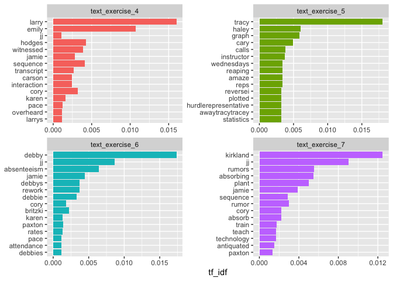
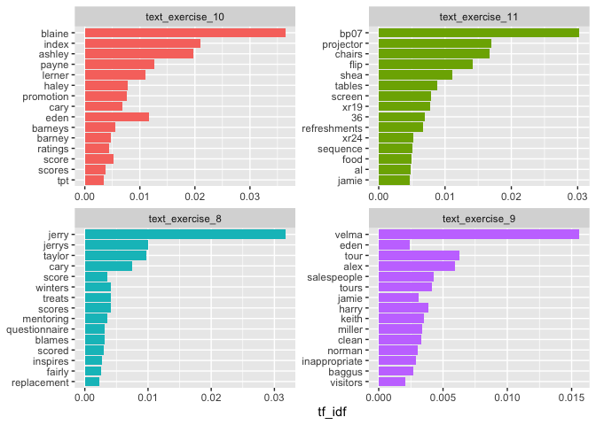
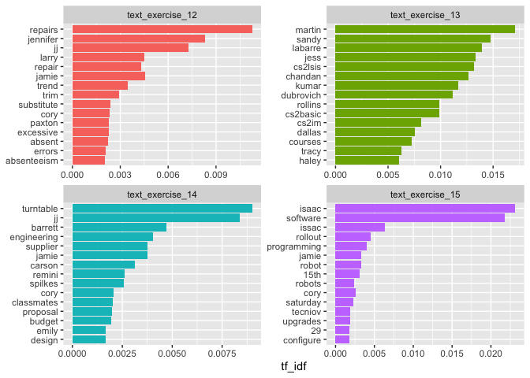
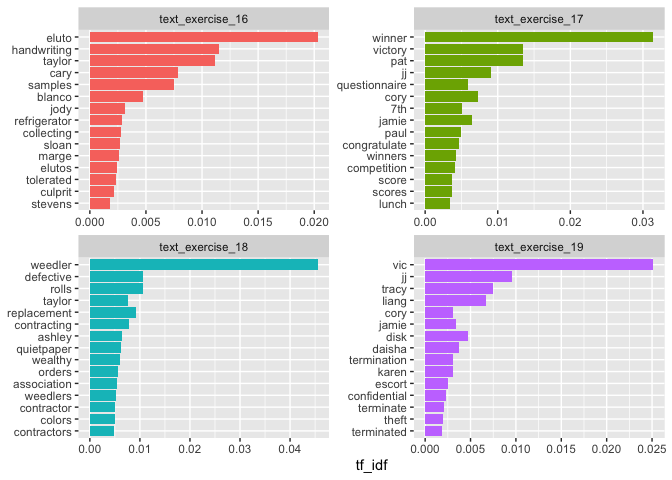
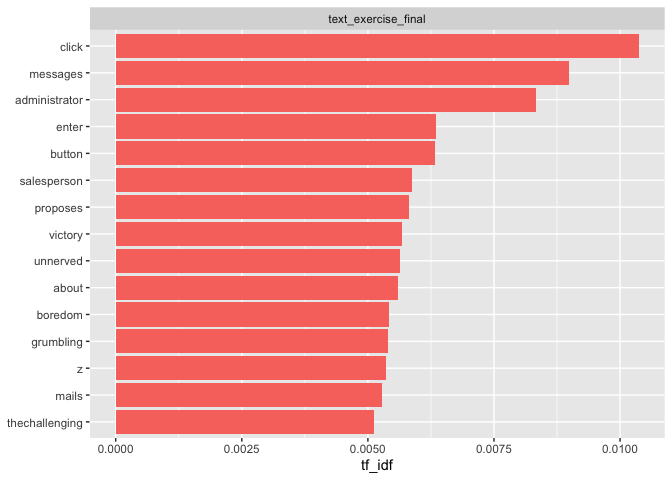
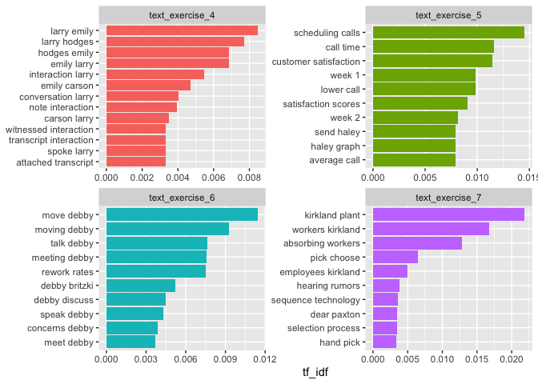
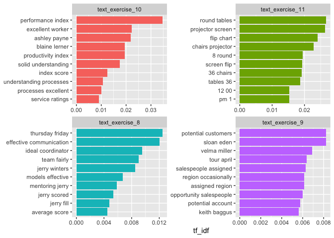
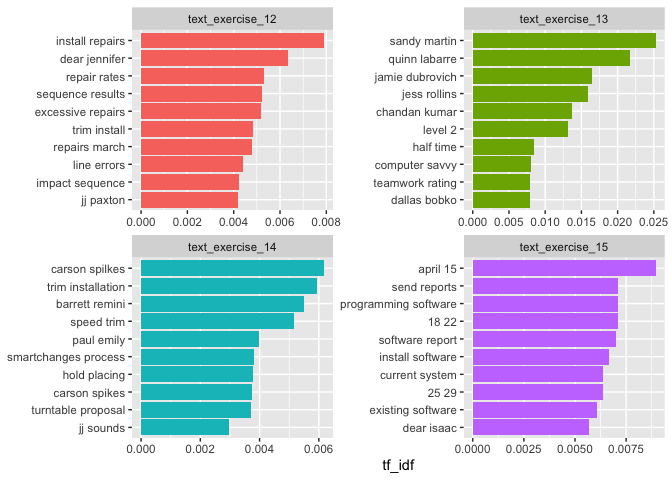
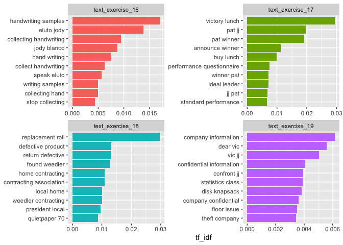
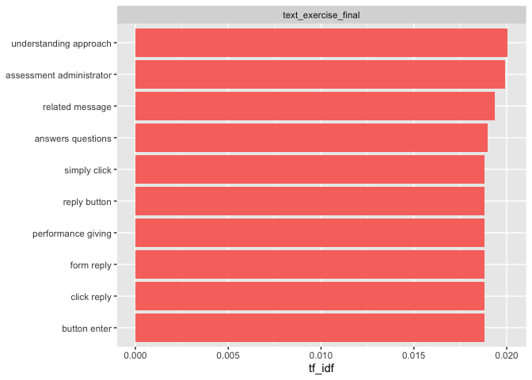

Ash’s EDA
================
Ashleigh Wilson
2023-03-23

## Analyzing word frequencies in exercises

``` r
# read in the tidy data set
tidy_train_data <- read_csv(here("data/tidy_stopwords_removed.csv"))
```

``` r
# this code transforms the text exercises from wide to long format. 
df_long <- pivot_longer(
  tidy_train_data,
  cols = starts_with("text"),
  names_to = "exercises",
  values_to = "text"
)

df_long
```

    ## # A tibble: 24,922 × 10
    ##    respo…¹ ratin…² ratin…³ ratin…⁴ ratin…⁵ ratin…⁶ ratin…⁷ ratin…⁸ exerc…⁹ text 
    ##    <chr>     <dbl>   <dbl>   <dbl>   <dbl>   <dbl>   <dbl>   <dbl> <chr>   <chr>
    ##  1 NlmLRJ…       2       2       2       2       2       3       2 text_e… <NA> 
    ##  2 NlmLRJ…       2       2       2       2       2       3       2 text_e… hi t…
    ##  3 NlmLRJ…       2       2       2       2       2       3       2 text_e… <NA> 
    ##  4 NlmLRJ…       2       2       2       2       2       3       2 text_e… <NA> 
    ##  5 NlmLRJ…       2       2       2       2       2       3       2 text_e… hi t…
    ##  6 NlmLRJ…       2       2       2       2       2       3       2 text_e… tayl…
    ##  7 NlmLRJ…       2       2       2       2       2       3       2 text_e… hale…
    ##  8 NlmLRJ…       2       2       2       2       2       3       2 text_e… <NA> 
    ##  9 NlmLRJ…       2       2       2       2       2       3       2 text_e… <NA> 
    ## 10 NlmLRJ…       2       2       2       2       2       3       2 text_e… kim …
    ## # … with 24,912 more rows, and abbreviated variable names ¹​response_id,
    ## #   ²​rating_chooses_appropriate_action, ³​rating_commits_to_action,
    ## #   ⁴​rating_gathers_information, ⁵​rating_identifies_issues_opportunities,
    ## #   ⁶​rating_interprets_information, ⁷​rating_involves_others,
    ## #   ⁸​rating_decision_making_final_score, ⁹​exercises

``` r
# this unnests the text into tokens and finds the count of words per exercise
exercise_words_freq <- df_long |> 
  select(exercises, text) |> 
  unnest_tokens(word, text) |> 
  count(exercises, word, sort = TRUE)

exercise_words_freq
```

    ## # A tibble: 70,394 × 3
    ##    exercises           word            n
    ##    <chr>               <chr>       <int>
    ##  1 text_exercise_final team         9873
    ##  2 text_exercise_final 2            7307
    ##  3 text_exercise_final e            6974
    ##  4 text_exercise_final questions    6027
    ##  5 text_exercise_final important    5990
    ##  6 text_exercise_final message      5483
    ##  7 text_exercise_final company      5318
    ##  8 text_exercise_final information  5042
    ##  9 text_exercise_final reply        4727
    ## 10 text_exercise_final i            4455
    ## # … with 70,384 more rows

### Term Frequency and Inverse Document Freqency

- term frequency (tf), how frequently a word occurs in a document
- tf-idf is intended to measure how important a word is to a document in
  a collection (or corpus) of documents.
  - The idea of tf-idf is to find the important words for the content of
    each document by decreasing the weight for commonly used words and
    increasing the weight for words that are not used very much.

Bind the term frequency and inverse document frequency and then sort by
words with high tf_idf (important words by weight)

``` r
exercise_words_tf_freq <- exercise_words_freq |> 
  bind_tf_idf(word, exercises, n) |> 
  arrange(desc(tf_idf))

exercise_words_tf_freq
```

    ## # A tibble: 70,394 × 6
    ##    exercises        word         n     tf   idf tf_idf
    ##    <chr>            <chr>    <int>  <dbl> <dbl>  <dbl>
    ##  1 text_exercise_18 weedler    557 0.0263 1.73  0.0456
    ##  2 text_exercise_10 blaine     223 0.0170 2.14  0.0365
    ##  3 text_exercise_8  jerry      280 0.0260 1.22  0.0318
    ##  4 text_exercise_17 winner     463 0.0147 2.14  0.0314
    ##  5 text_exercise_11 bp07       634 0.0175 1.73  0.0303
    ##  6 text_exercise_19 vic        910 0.0174 1.45  0.0251
    ##  7 text_exercise_15 isaac      885 0.0160 1.45  0.0231
    ##  8 text_exercise_15 software  1361 0.0246 0.887 0.0218
    ##  9 text_exercise_10 index      190 0.0145 1.45  0.0210
    ## 10 text_exercise_16 eluto      113 0.0117 1.73  0.0203
    ## # … with 70,384 more rows

This code plots the top 15 highest tf-idf for each exercise:

``` r
exercise_words_tf_freq |> 
  group_by(exercises) |> 
  filter(exercises %in% c("text_exercise_4", "text_exercise_5", "text_exercise_6", "text_exercise_7")) |> 
  slice_max(tf_idf, n = 15) |>
  ungroup() |> 
  ggplot(aes(tf_idf, fct_reorder(word, tf_idf), fill = exercises)) + 
  geom_col(show.legend = FALSE) + 
  facet_wrap(~exercises, ncol = 2, scales = "free") + 
  labs(y = NULL) # this removes the y-axis label
```

<!-- -->

``` r
exercise_words_tf_freq |> 
  group_by(exercises) |> 
  filter(exercises %in% c("text_exercise_8", "text_exercise_9", "text_exercise_10", "text_exercise_11")) |> 
  slice_max(tf_idf, n = 15) |> 
  ungroup() |> 
  ggplot(aes(tf_idf, fct_reorder(word, tf_idf), fill = exercises)) +
  geom_col(show.legend = FALSE) +
  facet_wrap(~exercises, ncol = 2, scales = "free") +
  labs(y = NULL)
```

<!-- -->

``` r
exercise_words_tf_freq |> 
  group_by(exercises) |> 
  filter(exercises %in% c("text_exercise_12", "text_exercise_13", "text_exercise_14", "text_exercise_15")) |> 
  slice_max(tf_idf, n = 15) |> 
  ungroup() |> 
  ggplot(aes(tf_idf, fct_reorder(word, tf_idf), fill = exercises)) +
  geom_col(show.legend = FALSE) +
  facet_wrap(~exercises, ncol = 2, scales = "free") +
  labs(y = NULL)
```

<!-- -->

``` r
exercise_words_tf_freq |> 
  group_by(exercises) |> 
  filter(exercises %in% c("text_exercise_16", "text_exercise_17", "text_exercise_18", "text_exercise_19")) |> 
  slice_max(tf_idf, n = 15) |> 
  ungroup() |> 
  ggplot(aes(tf_idf, fct_reorder(word, tf_idf), fill = exercises)) +
  geom_col(show.legend = FALSE) +
  facet_wrap(~exercises, ncol = 2, scales = "free") +
  labs(y = NULL)
```

<!-- -->

``` r
exercise_words_tf_freq |> 
  group_by(exercises) |> 
  filter(exercises %in% c("text_exercise_final")) |> 
  slice_max(tf_idf, n = 15) |> 
  ungroup() |> 
  ggplot(aes(tf_idf, fct_reorder(word, tf_idf), fill = exercises)) +
  geom_col(show.legend = FALSE) +
  facet_wrap(~exercises, ncol = 2, scales = "free") +
  labs(y = NULL)
```

<!-- -->

## Analyzing n-grams

### Analyzing bi-grams

Create a dataframe that splits the exercise texts into bigrams (two
consecutive words)

``` r
df_bigrams <- df_long |> 
  select(exercises, text) |>
  unnest_tokens(bigram, text, token = "ngrams", n = 2)
  
df_bigrams
```

    ## # A tibble: 991,643 × 2
    ##    exercises       bigram             
    ##    <chr>           <chr>              
    ##  1 text_exercise_4 <NA>               
    ##  2 text_exercise_5 hi tracy           
    ##  3 text_exercise_5 tracy this         
    ##  4 text_exercise_5 this sounds        
    ##  5 text_exercise_5 sounds ionteresting
    ##  6 text_exercise_5 ionteresting prior 
    ##  7 text_exercise_5 prior sharing      
    ##  8 text_exercise_5 sharing results    
    ##  9 text_exercise_5 results rest       
    ## 10 text_exercise_5 rest team          
    ## # … with 991,633 more rows

I want to remove stop words (i.e., and, the, is, etc.).  
The code separates the bigrams into two columns of single words and
removes stop words from both columns.

``` r
df_bigrams_sep <- df_bigrams |> 
  separate(bigram, c("word1","word2"), sep = " ") |> 
  filter(!word1 %in% stop_words$word) |> 
  filter(!word2 %in% stop_words$word)
```

After removing stop words, combine the single word columns back into
bigrams.

``` r
df_bigrams_unite <- df_bigrams_sep |> 
  unite(bigram, word1, word2, sep = " ")

df_bigrams_unite
```

    ## # A tibble: 483,734 × 2
    ##    exercises       bigram             
    ##    <chr>           <chr>              
    ##  1 text_exercise_4 NA NA              
    ##  2 text_exercise_5 sounds ionteresting
    ##  3 text_exercise_5 ionteresting prior 
    ##  4 text_exercise_5 prior sharing      
    ##  5 text_exercise_5 sharing results    
    ##  6 text_exercise_5 results rest       
    ##  7 text_exercise_5 rest team          
    ##  8 text_exercise_5 team haley         
    ##  9 text_exercise_5 schedule meeting   
    ## 10 text_exercise_5 meeting cheryl     
    ## # … with 483,724 more rows

Bind the term frequency and inverse document frequency and then sort by
words with high tf_idf (important words by weight)

``` r
df_bigrams_counts <- df_bigrams_unite |> 
  count(exercises, bigram) |> 
  bind_tf_idf(bigram, exercises, n) |> 
  arrange(desc(tf_idf))

df_bigrams_counts
```

    ## # A tibble: 174,493 × 6
    ##    exercises        bigram                n      tf   idf tf_idf
    ##    <chr>            <chr>             <int>   <dbl> <dbl>  <dbl>
    ##  1 text_exercise_10 performance index   103 0.0162   2.14 0.0347
    ##  2 text_exercise_18 replacement roll    100 0.0105   2.83 0.0298
    ##  3 text_exercise_17 victory lunch       181 0.0137   2.14 0.0294
    ##  4 text_exercise_11 round tables        159 0.00942  2.83 0.0267
    ##  5 text_exercise_11 projector screen    157 0.00930  2.83 0.0263
    ##  6 text_exercise_13 sandy martin         72 0.00891  2.83 0.0252
    ##  7 text_exercise_11 flip chart          143 0.00847  2.83 0.0240
    ##  8 text_exercise_11 chairs projector    136 0.00805  2.83 0.0228
    ##  9 text_exercise_10 excellent worker     66 0.0104   2.14 0.0222
    ## 10 text_exercise_10 ashley payne         96 0.0151   1.45 0.0219
    ## # … with 174,483 more rows

Plot the top 15 highest tf-idf for each exercise

``` r
df_bigrams_counts |> 
  group_by(exercises) |> 
  filter(exercises %in% c("text_exercise_4", "text_exercise_5", "text_exercise_6", "text_exercise_7")) |> 
  slice_max(tf_idf, n = 10) |> 
  ungroup() |> 
  ggplot(aes(tf_idf, fct_reorder(bigram, tf_idf), fill = exercises)) +
  geom_col(show.legend = FALSE) +
  facet_wrap(~exercises, ncol = 2, scales = "free") +
  labs(y = NULL)
```

<!-- -->

``` r
df_bigrams_counts |> 
  group_by(exercises) |> 
  filter(exercises %in% c("text_exercise_8", "text_exercise_9", "text_exercise_10", "text_exercise_11")) |> 
  slice_max(tf_idf, n = 10) |> 
  ungroup() |> 
  ggplot(aes(tf_idf, fct_reorder(bigram, tf_idf), fill = exercises)) +
  geom_col(show.legend = FALSE) +
  facet_wrap(~exercises, ncol = 2, scales = "free") +
  labs(y = NULL)
```

<!-- -->

``` r
df_bigrams_counts |> 
  group_by(exercises) |> 
  filter(exercises %in% c("text_exercise_12", "text_exercise_13", "text_exercise_14", "text_exercise_15")) |> 
  slice_max(tf_idf, n = 10) |> 
  ungroup() |> 
  ggplot(aes(tf_idf, fct_reorder(bigram, tf_idf), fill = exercises)) +
  geom_col(show.legend = FALSE) +
  facet_wrap(~exercises, ncol = 2, scales = "free") +
  labs(y = NULL)
```

<!-- -->

``` r
df_bigrams_counts |> 
  group_by(exercises) |> 
  filter(exercises %in% c("text_exercise_16", "text_exercise_17", "text_exercise_18", "text_exercise_19")) |> 
  slice_max(tf_idf, n = 10) |> 
  ungroup() |> 
  ggplot(aes(tf_idf, fct_reorder(bigram, tf_idf), fill = exercises)) +
  geom_col(show.legend = FALSE) +
  facet_wrap(~exercises, ncol = 2, scales = "free") +
  labs(y = NULL)
```

<!-- -->

``` r
df_bigrams_counts |> 
  group_by(exercises) |> 
  filter(exercises %in% c("text_exercise_final")) |> 
  slice_max(tf_idf, n = 10) |> 
  ungroup() |> 
  ggplot(aes(tf_idf, fct_reorder(bigram, tf_idf), fill = exercises)) +
  geom_col(show.legend = FALSE) +
  facet_wrap(~exercises, ncol = 2, scales = "free") +
  labs(y = NULL)
```

<!-- -->
